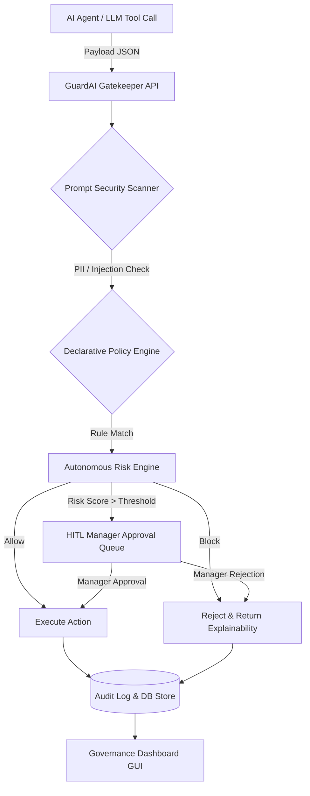

# 🛡️ GuardAI: Intelligent Action Governance Platform

[](https://github.com/Midhundg/GuardAI-Intelligent-Action-Governance-Platform)
[](https://github.com/Midhundg/GuardAI-Intelligent-Action-Governance-Platform)
[](https://fastapi.tiangolo.com/)
[](https://python.org)
[](LICENSE)

> **Enterprise-Grade AI Policy Enforcement, Autonomous Action Gatekeeping, Prompt Security Scanning, and Human-in-the-Loop Governance.**

---

## 📌 Executive Summary

**GuardAI** is a real-time, high-performance Action Governance Platform designed to intercept, analyze, score, and enforce policy constraints on autonomous AI agent execution payloads before they reach internal databases, third-party APIs, or production infrastructure.

Operating with **sub-20ms evaluation latency**, GuardAI protects modern enterprise AI stacks against unauthorized database purges, unapproved financial transactions, sensitive PII leakage, prompt injections, and rogue autonomous agent actions.

---

## 🚀 Key Features & Capabilities

### 🛡️ 1. Real-Time Action Gatekeeper & Declarative Policy Engine
- **Sub-20ms Decision Engine**: Intercepts tool calls and execution payloads in real time.
- **Declarative Rule Engine**: Supports threshold rules, pattern matching (`record_count_gt`, `action_equals`, `prompt_regex`), and dynamic severity categorization (`CRITICAL`, `HIGH`, `MEDIUM`, `LOW`).
- **Conflict Resolution**: Automated conflict matrix handles overlapping rules seamlessly.

### 🧠 2. Autonomous Risk Engine & AI Explainability Matrix
- **0–100 Weighted Risk Scoring**: Computes risk levels dynamically using record count, classification sensitivity (Confidential/Secret), external network traversal, and agent intent.
- **AI Explainability Engine**: Generates human-readable risk breakdowns and suggests safer alternative execution paths when an action is blocked.

### 🔍 3. Advanced Prompt Security & Data Loss Prevention (DLP)
- **PII Detection & Redaction**: Automatically scans and redacts SSNs, Credit Cards, API Keys, and Emails from agent payloads.
- **Prompt Injection Defense**: Detects jailbreaks, system-prompt overrides, and malicious instructions (`ignore previous instructions`).
- **Secret Leakage Prevention**: Blocks unauthorized exfiltration of AWS keys, JWT tokens, and private credentials.

### 👥 4. Human-in-the-Loop (HITL) Manager SLA Workflows
- **Approval Queue**: Automatically escalates high-risk or flagged actions to human managers.
- **SLA Expiration Engine**: Automatic SLA timeout enforcement (Expired, Approved, Rejected).
- **Concurrency Row Locking**: Database row locks (`with_for_update()`) prevent double-decisions during simultaneous manager reviews.

### 📊 5. Executive Governance Dashboard & Persona Switcher
- **Real-Time Visual Control**: Glassmorphism UI with live metrics, doughnut risk distribution, violation heatmaps, and audit streams.
- **Multi-Persona Role Switcher**: Switch instantly between **Admin**, **Manager Jane**, **Dev Alex**, and **Auditor Bob** to test RBAC in real-time.
- **Interactive Policy Simulator**: Prototype policy behavior against synthetic action payloads before deploying to production.

### 📈 6. LLM Token & Cost Analytics
- **Provider Breakdown**: Tracks OpenAI, Anthropic, and custom LLM model token usage and USD expenditures.
- **Cost Allocation**: Per-agent and per-department cost attribution models.

### 📜 7. Immutable Audit Trail & Telemetry
- **Structured Audit Stream**: Complete JSON/CSV exportable execution audit trail with execution latency, decision reasons, and risk scores.
- **Prometheus & OpenTelemetry**: Exposes `/metrics` for enterprise monitoring stack integration.

---

## 🏗️ System Architecture



---

## 🔑 Pre-Seeded Test Accounts (RBAC)

The platform comes pre-configured with 4 enterprise personas for instant testing:

| Username | Password | Role | Department | Description |
| :--- | :--- | :--- | :--- | :--- |
| `admin` | `Password123!` | `ADMIN` | Security & Risk | Full administrative rights & policy creation |
| `manager_jane` | `Password123!` | `MANAGER` | DevOps | Approval sign-off & escalation queue |
| `dev_alex` | `Password123!` | `EMPLOYEE` | Engineering | Standard agent developer / user |
| `auditor_bob` | `Password123!` | `AUDITOR` | Compliance | Read-only audit log & export access |

---

## 🛠️ Quickstart Installation & Setup

### Prerequisites
- **Python**: `3.11+` or `3.14`
- **Node.js**: `18.0+` (optional for E2E validation script)

### 1. Clone Repository & Setup Virtual Environment
```bash
git clone https://github.com/Midhundg/GuardAI-Intelligent-Action-Governance-Platform.git
cd GuardAI-Intelligent-Action-Governance-Platform/backend

# Create virtual environment
python3 -m venv .venv
source .venv/bin/python activate

# Install dependencies
pip install -r requirements.txt
```

### 2. Seed Database & Start Backend Server
```bash
# Seed default policies and test user accounts
python seed.py

# Start FastAPI server on port 8000
python -m uvicorn app.main:app --host 127.0.0.1 --port 8000 --reload
```

### 3. Launch Frontend Dashboard
In a new terminal window:
```bash
cd GuardAI-Intelligent-Action-Governance-Platform/frontend
python3 -m http.server 3000
```
Open **[http://localhost:3000](http://localhost:3000)** in your browser! 🚀

---

## 🧪 Testing & Quality Assurance

### Run Full Pytest Suite (37/37 Passed)
```bash
cd backend
pytest -v
```

### Run End-to-End Dashboard Validation Suite (9/9 Passed)
```bash
cd frontend
node test_e2e_dashboard.js
```

---

## 🐋 Docker & Container Deployment

```bash
# Build and run entire stack via Docker Compose
docker-compose up --build -d
```
Access points:
- **Frontend Dashboard**: `http://localhost:3000`
- **FastAPI Documentation**: `http://localhost:8000/docs`

---

## 📄 License & Contact

Distributed under the **MIT License**. Created & maintained by [Midhun DG](https://github.com/Midhundg).
