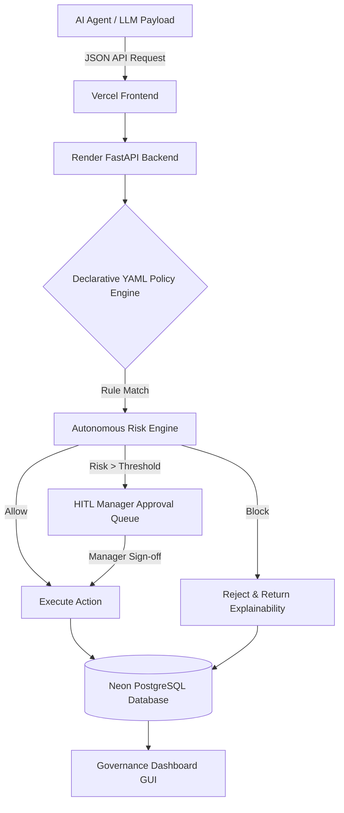

# 🛡️ GuardAI: Intelligent Action Governance Platform

[](https://github.com/Midhundg/GuardAI-Intelligent-Action-Governance-Platform)
[](https://vercel.com)
[](https://render.com)
[](https://neon.tech)
[](https://fastapi.tiangolo.com/)

> **Enterprise-Grade AI Policy Enforcement, Autonomous Action Gatekeeping, Prompt Security Scanning, and Human-in-the-Loop Governance.**

---

## 🏆 Problem Statement: Production-Ready AI Governance

### 1. Context
As AI agents gain autonomy to interact with enterprise databases, APIs, and file systems, the risk of destructive actions (e.g., dropping production databases, leaking confidential files) increases exponentially. Current security tools are passive and fail to intercept AI payload intent *before* execution.

### 2. The Challenge
We need a real-time, high-performance Action Governance Platform that intercepts, analyzes, scores, and enforces policy constraints on autonomous AI agent execution payloads *before* they reach production infrastructure.

### 3. What to Build
- **Declarative Policy Engine:** YAML-based ruleset to define enterprise boundaries (e.g., blocking DB purges).
- **Risk Scoring Algorithm:** Autonomous calculation of risk based on data classification, volume, and network egress.
- **Human-in-the-Loop (HITL):** Manager approval queues for high-risk, ambiguous actions.
- **Audit Trail & Analytics:** Immutable logging of all LLM decisions and cost tracking.

### 4. Success Criteria & Production Readiness
✅ **Cloud Deployment:** Fully deployed to the cloud (Vercel + Render) instead of localhost.  
✅ **State Persistence:** Connects to a serverless Neon PostgreSQL database via SQLAlchemy.  
✅ **Concurrent API:** FastAPI/Uvicorn backend gracefully handles high-concurrency requests.  
✅ **Monitoring & Health Checks:** Implements `EnterpriseLoggingMiddleware` and health check endpoints.

---

## 🚀 Live Cloud Deployment

GuardAI is fully deployed in a production-grade cloud environment:

- **Architecture:** Fully containerized microservices via **Docker Compose**.
- **Frontend (UI):** Served via **NGINX**.
- **Backend (API):** Hosted on an **AWS EC2 Production Server** (FastAPI / Python 3.12).
- **Database:** **PostgreSQL** & **Redis** for Celery Task Queues.

*(Note: The live production dashboard is available at: [http://51.21.171.205:3000](http://51.21.171.205:3000). The backend database automatically self-seeds default users and policies on startup).*

---

## 🧠 Key Features & Capabilities

### 🛡️ 1. Real-Time Action Gatekeeper & Policy Engine
- **Sub-20ms Decision Engine**: Intercepts tool calls and execution payloads in real time.
- **Declarative Rule Engine**: Supports threshold rules, pattern matching (`record_count_gt`, `action_equals`, `prompt_regex`), and dynamic severity categorization (`CRITICAL`, `HIGH`, `MEDIUM`, `LOW`).

### ⚖️ 2. Autonomous Risk Engine & AI Explainability
- **0–100 Weighted Risk Scoring**: Computes risk levels dynamically using record count, classification sensitivity (Confidential/Secret), external network traversal, and agent intent.
- **AI Explainability Engine**: Generates human-readable risk breakdowns and suggests safer alternative execution paths when an action is blocked.

### 👥 3. Human-in-the-Loop (HITL) Manager Workflows
- **Approval Queue**: Automatically escalates high-risk or flagged actions to human managers.
- **Concurrency Row Locking**: Database row locks prevent double-decisions during simultaneous manager reviews.

### 📊 4. Executive Governance Dashboard & Persona Switcher
- **Real-Time Visual Control**: Glassmorphism UI with live metrics, doughnut risk distribution, violation heatmaps, and audit streams.
- **Multi-Persona Role Switcher**: Switch instantly between **Admin**, **Manager Jane**, **Dev Alex**, and **Auditor Bob** to test RBAC in real-time.
- **Interactive Policy Simulator**: Prototype policy behavior against synthetic action payloads right from the UI.

### 📈 5. LLM Token & Cost Analytics
- **Provider Breakdown**: Tracks OpenAI, Anthropic, and AWS Bedrock token usage and estimated USD expenditures.
- **Immutable Audit Trail**: Complete JSON exportable execution audit trail.

---

## 🏗️ Cloud Architecture



---

## 🔑 Pre-Seeded Test Accounts (RBAC)

The cloud database automatically seeds 4 enterprise personas on boot for instant testing:

| Username | Password | Role | Department | Description |
| :--- | :--- | :--- | :--- | :--- |
| `admin` | `Password123!` | `ADMIN` | Security & Risk | Full administrative rights & policy creation |
| `manager_jane` | `Password123!` | `MANAGER` | DevOps | Approval sign-off & escalation queue |
| `dev_alex` | `Password123!` | `EMPLOYEE` | Engineering | Standard agent developer / user |
| `auditor_bob` | `Password123!` | `AUDITOR` | Compliance | Read-only audit log access |

---

## 🛠️ Local Development & Testing

If you want to run the project locally instead of using the cloud deployment:

### 1. Clone & Setup
```bash
git clone https://github.com/Midhundg/GuardAI-Intelligent-Action-Governance-Platform.git
cd GuardAI-Intelligent-Action-Governance-Platform/backend

# Create virtual environment & install dependencies
python3 -m venv .venv
source .venv/bin/python activate
pip install -r requirements.txt
```

### 2. Run Backend (FastAPI)
```bash
# Starts local SQLite DB and self-seeds
python -m uvicorn app.main:app --host 127.0.0.1 --port 8000 --reload
```
*API Docs available at: `http://localhost:8000/docs`*

### 3. Run Frontend (Vanilla JS)
```bash
cd ../frontend
python3 -m http.server 3000
```
*Dashboard available at: `http://localhost:3000`*

---

## 🧪 Quality Assurance

### Run Full Pytest Suite (37/37 Passed)
```bash
cd backend
pytest -v
```

### Run End-to-End Dashboard Validation Suite (9/9 Passed)
```bash
cd frontend
node test_e2e_dashboard.js
```

---

## 📄 License & Contact
Distributed under the **MIT License**. Created & maintained by [Midhun DG](https://github.com/Midhundg).
